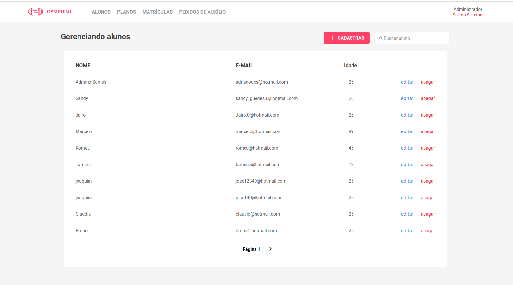

<h1 align="center">
  
</h1>

<h3 align="center">
  Gympoint
</h3>

## :rocket: Gym Point
> App para controle de academia, agendamento de alunos, dos administradores, planos, controle de frequencia.

### App de Academia com controle total sobre:

- Controle e cadastro dos Clientes/Administrador.
- Cadastro dos usuarios.
- Criação de planos personalizados, com tempo e valor.
- Matricula do aluno, com algum plano, criando um controle automatico de tempo restante do aluno, e se esta ativo ou não.
- Listagem de todos os alunos, e alunos matriculados na academia.
- Envio de e-mail para o aluno quando ele for matriculado, passando as informações do plano matriculado.
- Opção do cliente enviar suas duvidas, e receber as respostas do Instrutor da academia direto por sua pagina, e sempre que receber uma resposta, recebera um e-mail com a pergunta, e a resposta que obteve.

>Tela Inicial da aplicação Web

</img>

>Tela login aplicação Mobile
 
</img>

>Dentro da pasta de cada aplicação, tem mais fotos!

## Criado por:

Fernando Santos – [@Fernando](https://www.linkedin.com/in/fernando-santos-686632122/) 
